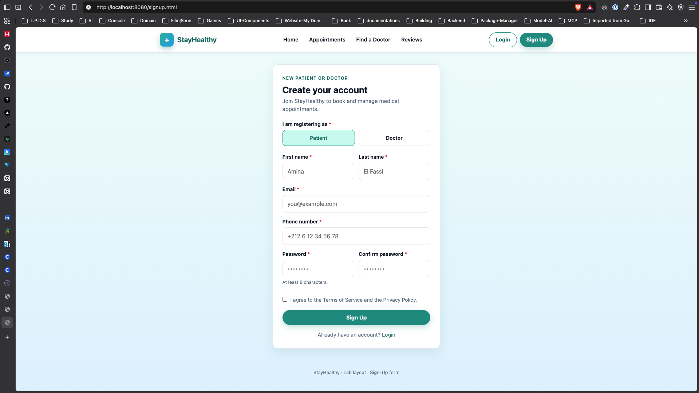

# StayHealthy

HTML and CSS for the medical appointment booking lab. Three pages: the navbar on the home screen, the sign-up form, and the login form. Shared styles live in `css/styles.css`.

Preview with any static server:

```bash
python3 -m http.server 8080
```

Then open [http://localhost:8080](http://localhost:8080).

## Home


## Login


## Sign up


