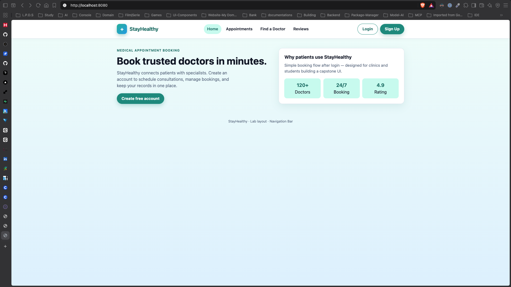
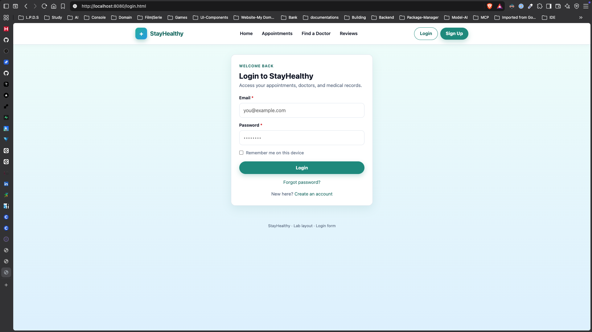

# StayHealthy

Medical appointment booking layouts. Each screen has its own folder, with the HTML and CSS kept together.

```
Landing_Page/   LandingPage.html  LandingPage.css
Login/          Login.html        Login.css
Navbar/         Navbar.html       Navbar.css
Sign_up/        Sign_up.html      Sign_up.css
```

```bash
python3 -m http.server 8080
```

Home: <http://localhost:8080/Landing_Page/LandingPage.html>

Login and Sign Up in the navbar go to those forms. Each form links back to the other.

## Home



## Login



## Sign up


